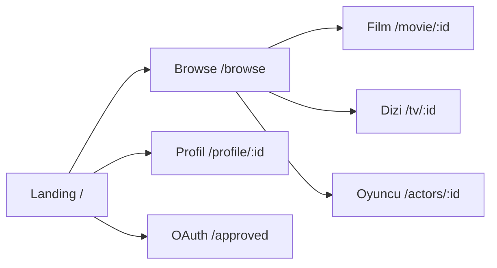

<div align="center">


### Film ve dizi keşfi — TMDB ile güçlendirilmiş modern web arayüzü

**CineOrbit**, [The Movie Database (TMDB)](https://www.themoviedb.org/) API’sini kullanan, **React** ve **Redux Toolkit** tabanlı bir keşif uygulamasıdır. Açık/koyu tema, çoklu dil ve sesli asistan desteğiyle tek bir arayüzde film, dizi ve oyuncu içeriklerine ulaşmanızı sağlar.

[](https://reactjs.org/)
[](https://redux-toolkit.js.org/)
[](https://mui.com/)
[](https://www.docker.com/)
[](https://www.themoviedb.org/documentation/api)

[](https://github.com/ozcan-kutlu/CineOrbit)
[](https://github.com/ozcan-kutlu/CineOrbit/tree/main/src/locales)

[Özellikler](#-özellikler) · [Hızlı başlangıç](#-hızlı-başlangıç) · [Docker](#-docker) · [Proje yapısı](#-proje-yapısı) · [Güvenlik](#-güvenlik)

</div>

---

## Özellikler

| | |
|:---|:---|
| **Ana sayfa** | Hero bölümü, trend içerikler ve popüler film / dizi önizlemeleri |
| **Keşif** | Kategoriler, türler ve arama ile tam sayfa ızgara görünümü (`/browse`) |
| **Detay sayfaları** | Film, dizi, oyuncu ve profil rotaları; zengin metadata |
| **Kimlik doğrulama** | TMDB OAuth akışı; callback `/approved` |
| **Tema** | Material UI ile tutarlı, açık / koyu mod |
| **Çoklu dil** | İngilizce ve Türkçe; tercih `localStorage` (`cineorbit_language`) |
| **Sesli asistan** | Aktif dile göre **en-US** / **tr-TR** konuşma tanıma |

### Uygulama akışı (özet)



---

## Teknoloji yığını

| Katman | Teknoloji |
|--------|-----------|
| UI | React 17, Material UI (MUI) v5, Emotion |
| Durum & veri | Redux Toolkit, RTK Query, React Redux |
| HTTP | Axios |
| Yönlendirme | React Router v5 |
| Yerelleştirme | i18next, react-i18next |
| Kalite | ESLint (Airbnb), Testing Library |
| Dağıtım (isteğe bağlı) | Docker Compose, Nginx — uygulama **8080** |

---

## Gereksinimler

- **Node.js** 18+
- **npm** 9+
- [TMDB](https://www.themoviedb.org/settings/api) API anahtarı

---

## Ortam değişkenleri

`.env.example` dosyasını `.env` olarak kopyalayın ve değerleri doldurun:

| Değişken | Açıklama |
|----------|----------|
| `REACT_APP_TMDB_KEY` | TMDB API anahtarı |
| `REACT_APP_TMDB_REDIRECT_URL` | OAuth geri çağırma URL’si (örn. `/approved` tam adresi) |

Örnek:

```env
REACT_APP_TMDB_KEY=your_tmdb_api_key_here
REACT_APP_TMDB_REDIRECT_URL=http://localhost:3000/approved
```

---

## Hızlı başlangıç

```bash
npm install
npm run start
```

Uygulama varsayılan olarak **http://localhost:3000** adresinde açılır.

### Faydalı komutlar

```bash
npm run lint          # ESLint
npm run lint:fix      # Otomatik düzeltmeler
npm run i18n:check    # Çeviri anahtarları tutarlılığı
npm run test:ci       # Testler (watch kapalı)
npm run build         # Üretim derlemesi
```

---

## Docker

1. `.env` oluşturun; `REACT_APP_TMDB_KEY` zorunlu. Konteyner için geri çağırma adresi genelde:

   `REACT_APP_TMDB_REDIRECT_URL=http://localhost:8080/approved`

   (TMDB uygulama ayarlarındaki callback listesiyle aynı olmalı.)

2. Proje kökünde:

```bash
docker compose up -d --build
```

Tarayıcıda **http://localhost:8080** — port **8080**, yerelde 3000 ile çakışmayı azaltmak içindir.

Arayüz veya `.env` değişince:

```bash
npm run docker:refresh
```

Durdurmak: `npm run docker:down`.

---

## Proje yapısı

```
src/
├── app/           Redux store kurulumu
├── features/      Redux slice’lar
├── services/      RTK Query / TMDB API katmanı
├── utils/         Yardımcı fonksiyonlar ve API destekleri
├── components/    Sayfalar ve UI bileşenleri
└── locales/       en.json, tr.json
```

### Rotalar

| Rota | İçerik |
|------|--------|
| `/` | Ana sayfa (hero, trend, popüler önizlemeler) |
| `/browse` | Tam keşif ızgarası (kategori, tür, arama) |
| `/movie/:id`, `/tv/:id`, `/actors/:id`, `/profile/:id` | Detay ve profil |
| `/approved` | TMDB OAuth onayı |

### Yerelleştirme (i18n)

- Metinler: `src/locales/en.json`, `src/locales/tr.json`
- Uygulama çubuğunda **EN / TR** anahtarı (tema düğmesinin yanında)
- Varsayılan dil tarayıcıya göre; yedek dil İngilizce

---

## Dağıtım

```bash
npm run build
```

`build` klasörünü Nginx veya herhangi bir statik dosya sunucusu ile yayınlayın.

---

## Güvenlik

- Gerçek anahtarları repoya ve `.env` commit’lerine eklemeyin.
- Sızan TMDB anahtarlarını [TMDB ayarlarından](https://www.themoviedb.org/settings/api) yenileyin.
- Tarayıcıda oturum / kimlik verisini minimumda tutun.

---

<div align="center">

**CineOrbit** — TMDB ile sinema ve dizi dünyasında yörünge.

[TMDB API](https://developer.themoviedb.org/docs) · [Sorun bildir](https://github.com/ozcan-kutlu/CineOrbit/issues)

</div>

---

## English summary

**CineOrbit** is a React + Redux movie and TV discovery app powered by the **TMDB API**. It includes browse/search, detail pages, TMDB OAuth, light/dark theme, **EN/TR** i18n, and a voice assistant with locale-aware speech recognition. Run locally with `npm install && npm run start`, or use Docker on port **8080** as documented above.
